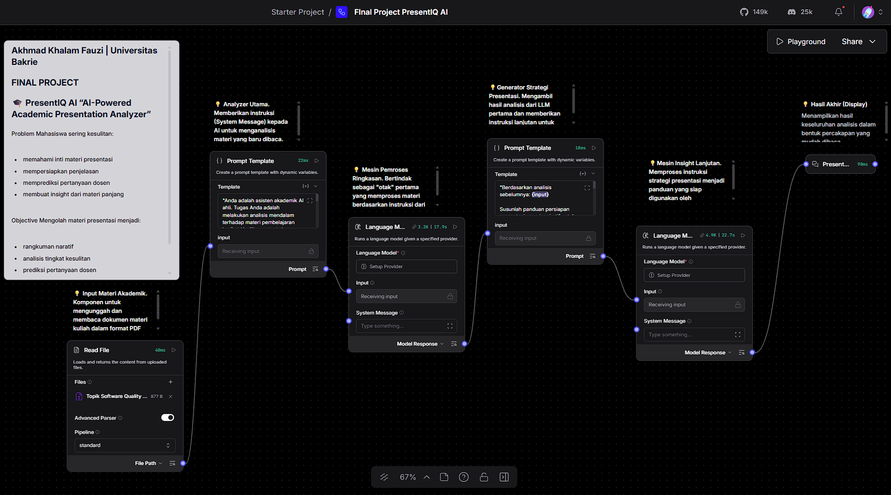

# PresentIQ AI – AI-Powered Academic Presentation Analyzer

PresentIQ AI adalah sistem otomatisasi alur kerja (AI workflow orchestration) yang dibangun menggunakan **Langflow**. Proyek ini dirancang khusus untuk membantu mahasiswa mempersiapkan presentasi akademis, kuis, atau sidang secara lebih prediktif dan efektif.

Sistem ini mengekstrak materi pembelajaran, menganalisis kedalaman konten, memprediksi Persona Dosen, hingga menghasilkan simulasi tanya-jawab (Q&A) yang terstruktur.

## 🚀 Fitur Utama
1. **Materi Ingestion**: Mampu membaca berkas dokumen akademis atau bahan presentasi.
2. **Chained LLM Processing**: Memproses dokumen melalui beberapa tahap pemodelan bahasa untuk menghasilkan ringkasan eksekutif dan poin diskusi utama.
3. **Lecturer Persona Simulation**: Menganalisis tingkat kesulitan materi dan mensimulasikan pertanyaan prediktif yang kemungkinan besar akan diajukan oleh dosen penguji.
4. **Structured Output**: Mengembalikan rekomendasi tips, set pertanyaan, beserta draf jawaban dalam format Markdown/JSON yang rapi dan siap dipelajari.

## 🛠️ Arsitektur & Teknologi
* **Orchestration Tool**: Langflow
* **Core Architecture**: Chained Large Language Models (LLMs) & Custom Prompt Engineering
* **Output Node**: Structured Template Formatting

*Gambaran alur kerja multi-step node pada kanvas Langflow.*

## 💻 Cara Mencoba Workflow Ini
1. Pastikan Anda sudah menginstal dan menjalankan **Langflow** di lingkungan lokal Anda.
2. Unduh berkas konfigurasi alur kerja kami di folder `workflow/presentiq_ai.json`.
3. Buka dasbor Langflow, klik **Import**, lalu pilih berkas `.json` tersebut.
4. Hubungkan komponen API Key LLM Anda, dan workflow siap dijalankan melalui Playground!
